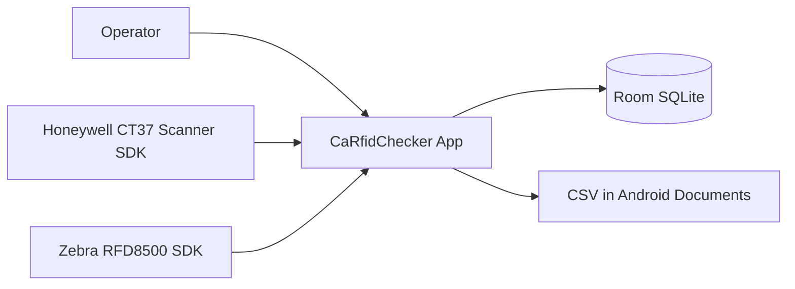
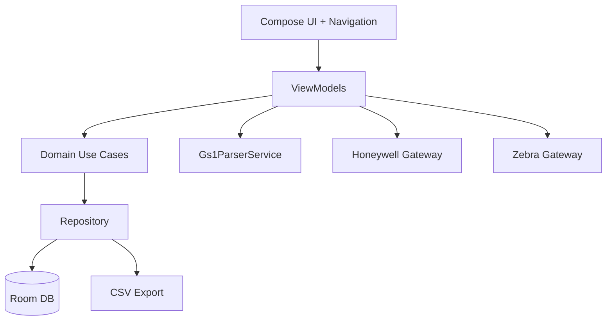
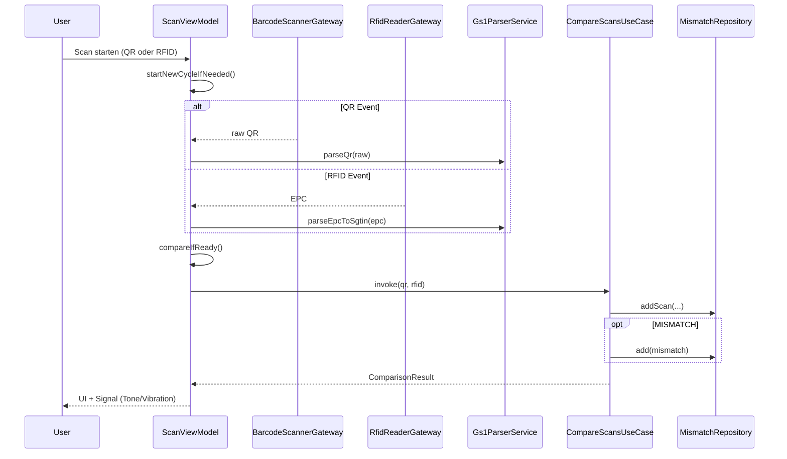

# Business Architect Sicht - Architektur

## Dokumentsteuerung

- Version: 1.1
- Perspektive: Solution/Business Architecture (As-Is + Zielbild)
- Quellen: `AGENTS.md`, `CLAUDE.md`, `app/src/main/java/de/ca/rfidchecker/`

## 1) Architekturziele

- G1: Verlaesslicher Echtzeit-Vergleich von QR und RFID unter Shopfloor-Bedingungen
- G2: Trennscharfe Verantwortlichkeiten (UI, Domain, Data, Device)
- G3: Hohe Wartbarkeit trotz Vendor-SDK-Abhaengigkeiten
- G4: Erweiterbarkeit fuer zusaetzliche Use Cases (z. B. Inbound Read)

## 2) Leitprinzipien

- Clean Architecture mit gerichteten Abhaengigkeiten
- MVVM fuer UI-State und Ereignisorchestrierung
- Hardwarekopplung nur ueber Gateway-Interfaces
- Reaktive Datenstroeme via Flow/StateFlow
- Persistenz als Quelle fuer operative Metriken und Export

## 3) Kontextsicht (C4-L1)



## 4) Containersicht (C4-L2)



## 5) Layer-Architektur (Ist)

```text
Presentation Layer
  - MainActivity, DashboardScreen, ReaderConfigScreen, ...
  - ScanViewModel, DashboardViewModel, ExportViewModel

Domain Layer
  - CompareScansUseCase
  - Domain Models (QrScanResult, RfidScanResult, ComparisonResult, ...)

Data Layer
  - MismatchRepository
  - Room AppDatabase + DAOs + Entities + Migrations

Device Layer
  - HoneywellCt37ScannerGateway
  - ZebraRfd8500Gateway

Core Services
  - Gs1ParserService (Parsing / Validierung)
```

## 6) Schluesselkomponenten und Verantwortung

- `app/MainActivity.kt`
  - Kompositionswurzel, Navigation, Drawer
  - Lifecycle-Hooks fuer Honeywell (`claim/release/close`)
- `feature/scan/ScanViewModel.kt`
  - Zyklussteuerung, Zustand, Triggerlogik, Vergleichsausloesung
- `core/gs1/Gs1ParserService.kt`
  - Fachliche Dekodierung und Validierung von QR/EPC
- `domain/usecase/UseCases.kt` (`CompareScansUseCase`)
  - Fachregelbasierte Vergleichsentscheidung + Persistenztrigger
- `data/repository/Repositories.kt` (`MismatchRepository`)
  - Room-Abstraktion und CSV Export
- `device/zebra/ZebraRfd8500Gateway.kt`
  - Discovery, Connect, Eventlisten, Single-Tag Inventory

## 7) Laufzeitverhalten (Vergleichszyklus)



## 8) Schnittstellen und Abhaengigkeiten

- UI -> ViewModel: unidirektional ueber State und Callback-Events
- ViewModel -> Gateway: ueber `BarcodeScannerGateway` und `RfidReaderGateway`
- ViewModel -> Domain: `CompareScansUseCase`
- Domain -> Data: `MismatchRepository`
- Keine direkte UI-zu-DB Kopplung

## 9) Qualitaetsattribute

### Verfuegbarkeit
- Ziel: Robuster Betrieb trotz Reader-Disconnect
- Hebel: Statusflows, Reconnect-Pfad, defensive `runCatching` Nutzung

### Wartbarkeit
- Ziel: Kleine, klar verantwortete Module
- Hebel: Layering, Gateway-Abstraktion, UseCase-Kapselung

### Erweiterbarkeit
- Ziel: Neue Use Cases ohne Bruch des Kernflusses
- Hebel: Feature-Pakete, Parser-Erweiterung, zusätzliche UseCases

### Nachvollziehbarkeit
- Ziel: Jede Entscheidung reproduzierbar
- Hebel: Room Persistenz + CSV Export

## 10) Architekturentscheidungen (ADR-Kurzliste)

- ADR-01: MVVM + StateFlow fuer UI-Reaktivitaet
  - Grund: Gute Compose-Integration, testbarer State
- ADR-02: Hardwarezugriff ueber Gateways
  - Grund: Entkopplung von Vendor SDKs
- ADR-03: Zebra Single-Tag pro Session
  - Grund: QCC-Fachfall prueft jeweils ein Objekt
- ADR-04: NavHost-weit gescopte ViewModels (As-Is)
  - Grund: Schnelle Einfuehrung; Nachteil bei Feature-Skalierung

## 11) Architektur-Risiken und Schulden

- AR-01 Harte Textmeldungen in ViewModels statt durchgaengiger Ressourcen
- AR-02 Globale ViewModel-Lebensdauer kann Seiteneffekte beguenstigen
- AR-03 Vendor AARs lokal statt Artefakt-Repository
- AR-04 Fehlende Instrumented-Testabdeckung fuer Hardwarefluesse

## 12) Zielarchitektur (To-Be)

### Phase 1 - Konsolidierung
- Alle Routen in `navigation/Nav.kt` zentralisieren
- ViewModels pro Destination statt globalem Scope

### Phase 2 - Feature-Expansion
- Home/Tiles als Use-Case-Einstieg
- Inbound Read als separates Featurepaket

### Phase 3 - Integrationsarchitektur
- SSCC Parsing
- Multi-Tag Inventory Modus
- EPCIS 2.0 Adapter (Netzwerk-Layer + Retry/Monitoring)

## 13) Architektur-Governance

- Architekturreview bei jedem neuen Feature
- Pflichtpruefung bei Layer-Verletzung
- ADR-Update bei relevanter Designentscheidung
- Synchronisierung mit `docs/03-business-analyst-requirements.md` und `docs/05-tester-documentation.md`
